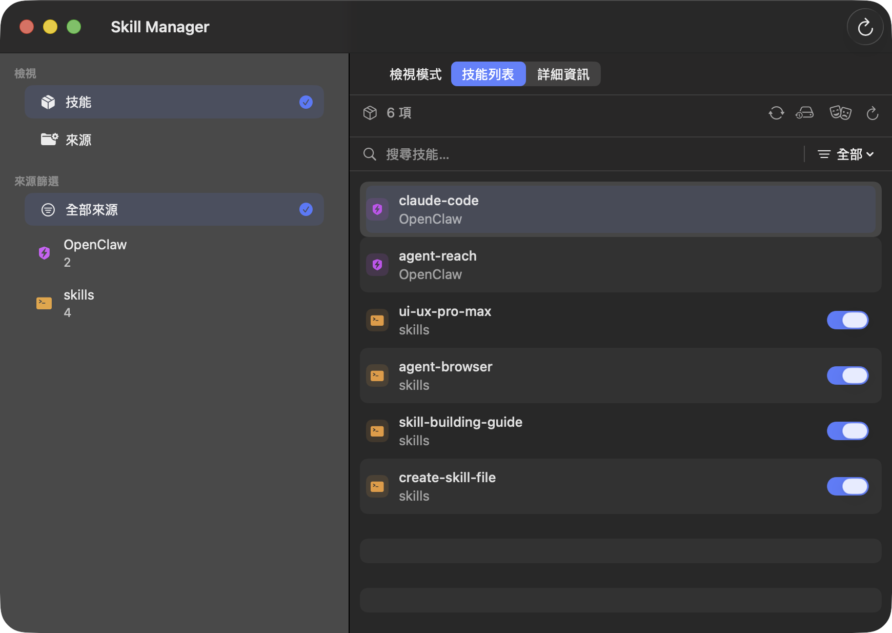

# SkillKit

專為 macOS 打造的原生 AI 技能管理工具，支援 Claude Code、OpenClaw 與自訂專案資料夾。



## 功能

- **統一管理** — 瀏覽並管理來自多個來源的技能
- **標籤系統** — 為技能加上標籤，快速篩選
- **情境切換** — 將技能分組成不同情境，一鍵切換
- **Git 備份** — 一鍵將技能來源備份到 git 遠端
- **更新追蹤** — 自動偵測有 git 來源的技能是否有新版本
- **安全掃描** — 掃描技能檔案是否有潛在安全疑慮
- **多語系** — 支援繁體中文與英文介面

## 支援來源

- Claude Code（`~/.claude/skills`）
- OpenClaw（`~/.openclaw/skills`）
- 任意本地專案資料夾

## 系統需求

- macOS 14+
- Xcode 15+（從原始碼建置）

## 建置方式

```bash
git clone https://github.com/zero1048/skillkit-mac.git
cd skillkit-mac
swift build -c release
```

或使用建置腳本產生 `.app`：

```bash
./scripts/build_app.sh
```

## 授權

MIT
